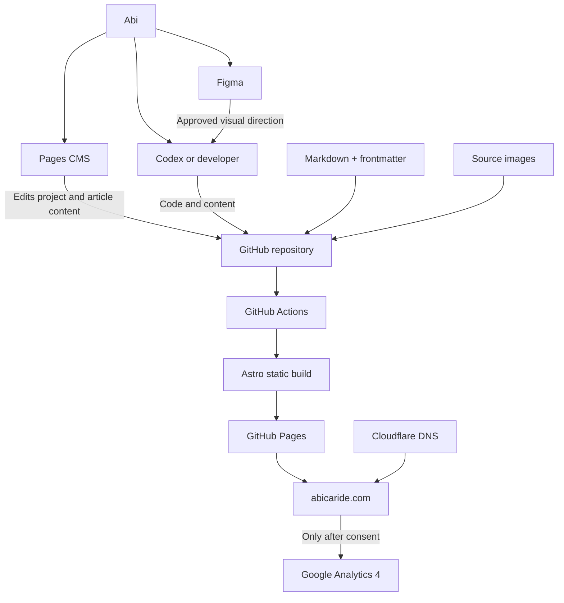
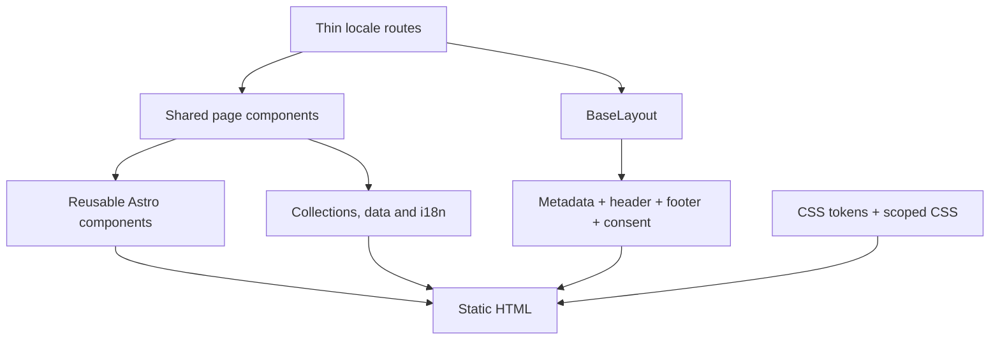
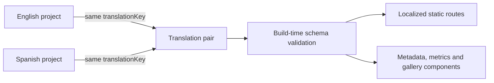
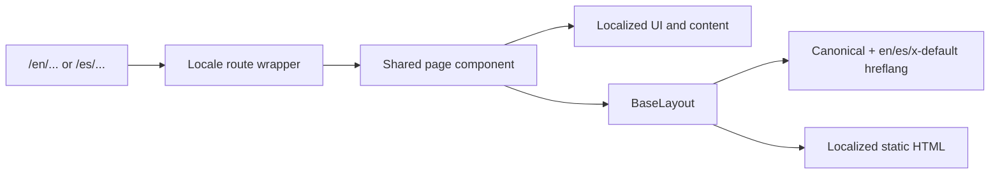
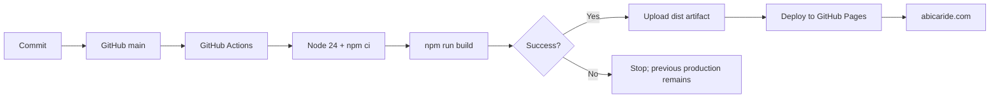
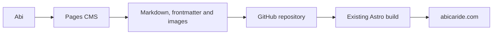
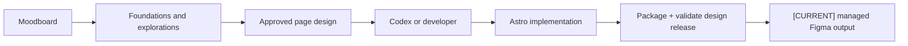

# Architecture of abicaride.com

This document describes the technical architecture of **abicaride.com** for a
technically literate reader who has not seen the project before. It documents
the current repository, separates implemented systems from plans and points to
the decisions that explain why the architecture exists.

## Status vocabulary

- **Implemented** — present in the repository or current operating environment.
- **External workflow** — adopted tooling that operates outside Astro at build
  and runtime.
- **Planned** — intended direction, not yet implemented.
- **Under consideration** — possible evolution without a committed decision.

## Project goals

abicaride.com is Abilene Caride's bilingual professional personal website. It is
a portfolio and professional identity site for presenting selected work,
experience and contact information in English and Spanish.

Its architecture optimizes for:

- simple operation and maintenance;
- fast, accessible static pages;
- portable content and assets;
- minimal JavaScript and dependencies;
- clear separation between content and presentation;
- privacy-conscious analytics;
- gradual complexity only when real requirements justify it.

## Architectural principles

### Static first

Astro generates HTML at build time. The current product does not need a backend,
runtime database or application server.

### Minimal client-side JavaScript

Pages are static HTML and CSS. Small native-script enhancements are deliberate:
the root language gateway reads browser language preferences without storage or
tracking, the theme bootstrap and header control apply a functional local visual
preference, the consent/analytics script responds to a visitor's local choice,
and long pages may add an `IntersectionObserver`-driven Back to top control.

### Git as the production source of truth

Code, content, configuration and relevant assets live in the GitHub repository.
Figma expresses design intention, and Pages CMS edits Git-managed project and
article files; neither replaces the repository.

### Content separated from presentation

Markdown, frontmatter, i18n copy and structured data hold information. Astro
components decide how that information is rendered.

### Accessibility, performance and privacy by default

Semantic HTML, visible focus, localized metadata, responsive images and
consent-gated analytics are architectural requirements rather than later
enhancements.

## High-level system architecture



The Pages CMS connection is an external editorial workflow, not an Astro runtime
dependency. Cloudflare is operational context documented by the project; its
configuration is external to this repository.

## Technology stack

### Application — Implemented

- Astro `^7.2.4` with static output;
- strict TypeScript through `astro/tsconfigs/strict`;
- Astro components and semantic HTML;
- native CSS and CSS custom properties;
- self-hosted Inter and Montserrat WOFF2 files with no runtime font request;
- no client UI framework.

Astro is the only production dependency in `package.json`.

### Content — Implemented

- Astro Content Collections;
- Markdown bodies and validated frontmatter;
- bilingual `projects` and `writing` collections;
- structured bilingual data in `src/data/`;
- source-controlled local assets processed by Astro.

### Hosting — Implemented

- GitHub repository and Git history;
- GitHub Actions build workflow;
- GitHub Pages static hosting;
- Cloudflare-managed DNS outside the repository.

### Analytics — Implemented

- Google Analytics 4 through the Google tag;
- Basic Consent Mode v2 semantics;
- no Google Tag Manager or third-party consent platform;
- no custom analytics events or advertising features.

### Design and development — Implemented

- Figma for visual intention and exploration;
- Git and GitHub for source control;
- Codex or a local editor for implementation work.

### Editorial — External workflow

- Pages CMS collections for routine EN/ES project and article changes;
- GitHub authentication and repository permissions for each editor;
- the existing Markdown, frontmatter and source images as the edited data.

### Under consideration

- which selected static-page content, if any, should become CMS-editable;
- preview and editorial validation behaviour beyond the current draft workflow.

## Repository structure

```text
src/
├── assets/                 Source images and self-hosted fonts
├── components/
│   ├── case-studies/       Intentional bespoke case-study renderers
│   └── pages/              Shared EN/ES page composition
├── content/
│   ├── projects/
│   │   ├── en/             English project Markdown
│   │   └── es/             Spanish project Markdown
│   └── writing/
│       ├── en/             English editorial Markdown
│       └── es/             Spanish editorial Markdown
├── data/                   Other structured bilingual content
├── i18n/                   Locale types, UI copy and path helpers
├── layouts/                Global HTML document layout
├── lib/                    Build-time content and routing helpers
├── pages/                  Static route entry points
└── styles/                 Design tokens and global CSS

tools/
└── figma/
    └── abi-brief-builder/  Optional local V2 brief plugin
```

Important boundaries:

- `src/pages/` owns routes. Locale files remain thin wrappers.
- `src/components/pages/` owns page composition shared by English and Spanish.
- `src/layouts/BaseLayout.astro` owns the document, global metadata, header,
  footer and consent component.
- `src/components/` owns reusable UI concepts.
- `src/i18n/config.ts` owns locale types, shared UI copy and localized paths.
- `src/content/projects/{locale}/` owns project narratives and metadata.
- `src/content/writing/{locale}/` owns editorial articles and metadata.
- `src/content.config.ts` owns both collection schemas.
- `src/data/` owns structured bilingual information outside collections.
- `src/styles/tokens.css` owns reusable design values; component styles remain
  scoped to their components.
- `src/assets/` owns images that enter Astro's processing pipeline. `public/`
  is reserved for stable URLs and files that Astro should not transform.
- `tools/figma/` owns optional local design-workflow utilities. They do not run
  in production and must not become Astro build dependencies.

See [`AGENTS.md`](../AGENTS.md) for operational rules that protect these
boundaries.

## Rendering architecture



No hydration directives or SPA shell are present. The resulting `dist/`
directory is a deployable static artifact.

## Interaction contracts

The project keeps a small, named interaction surface. Each flow has one owner
and a fallback appropriate to its risk:

| Interaction | Authoritative implementation | Required behaviour |
| --- | --- | --- |
| Root language gateway | `src/pages/index.astro` | Select the first supported browser preference, default to English, remain non-indexable and preserve manual EN/ES plus no-JavaScript links without storage or tracking |
| Primary and language navigation | `src/components/SiteHeader.astro`, `src/i18n/config.ts` and localized routing helpers | Use semantic links, expose active state and resolve the real translated path, including project and article slugs |
| Theme preference | `ThemeInitializer.astro`, `ThemeControl.astro` and semantic tokens in `src/styles/tokens.css` | Apply an explicit Light/Dark `abi-theme` preference before paint; when none exists, follow the browser/OS preference and its live changes across routes and locales |
| Homepage/contact CTAs | Native links and fragment anchors in page components | Preserve standard browser behaviour; email uses `mailto:` and selected work remains directly addressable |
| Back to top | `BaseLayout.astro` trigger plus `BackToTop.astro` | Reveal after the introductory region leaves view, remain keyboard accessible, respect reduced motion and avoid obstructing consent UI |
| Analytics choice and withdrawal | `AnalyticsConsent.astro`, `public/scripts/analytics-consent.js` and `data-cookie-settings` links | Make no Google request before acceptance, keep rejection request-free, persist the local choice and allow settings to reopen it |

These are contracts, not merely current visual details. New pages reuse the
global owners where relevant. An interaction change must be checked in English
and Spanish, with keyboard input and visible focus, at narrow and desktop
viewports, and against its privacy or no-JavaScript fallback where applicable.
Page-local script copies are an architectural regression.

## Content architecture

### Projects collection — Implemented

Project entries live under:

```text
src/content/projects/en/
src/content/projects/es/
```

Each file combines structured frontmatter with a Markdown body. The Markdown
body is the primary narrative. Structured fields exist when build-time
validation, routing or reusable presentation needs them.

The actual schema in `src/content.config.ts` contains:

| Field | Required | Purpose |
| --- | --- | --- |
| `title` | Yes | Localized project title |
| `description` | Yes | Localized summary and page metadata |
| `locale` | Yes | `en` or `es` |
| `routeSlug` | Yes | Locale-specific URL slug |
| `translationKey` | Yes | Pairs translations across locales |
| `category` | Yes | Localized project category |
| `year` | No | Numeric year when useful |
| `company` | No | Organization associated with the work |
| `client` | No | Client when different from company |
| `role` | No | Abi's role |
| `period` | No | Human-readable project period |
| `featured` | Default `false` | Selects prominent projects |
| `order` | Yes | Positive integer controlling listing order |
| `draft` | Schema fallback `false` | Excludes unpublished entries from generated pages; Pages CMS creates new entries as `true` |
| `image` | Yes | Astro-managed source plus localized alt text |
| `metrics` | No | Reusable value, label and optional detail items |
| `gallery` | No | Astro-managed images with alt text and optional captions |
| `externalUrl` | No | Valid source or archive URL |
| `externalLabel` | No | Localized external-link label |
| `tags` | Default `[]` | Localized topic labels |

Generic reusable fields are preferred over fields tied to one project. This
keeps the collection useful for future professional case studies without
turning it into a page builder. Optional fields remain absent until real content
requires them.



`getProjectStaticPaths()` filters drafts, creates locale-specific routes and
finds the translated counterpart. `ProjectPage.astro` renders the Markdown body
and optional structured components.

The imaginArt project is one intentional exception to generic Markdown page
composition. Paired collection entries continue to own routes, SEO and preview
metadata, while `ImaginartCaseStudy.astro` and typed bilingual data in
`src/data/imaginartCase.ts` render its evidence-led diagrams. This avoids both
forcing a story-specific layout into Markdown and introducing an arbitrary page
builder or CMS schema.

### Writing collection — Implemented

Editorial entries live separately from projects under:

```text
src/content/writing/en/
src/content/writing/es/
```

The intentionally small schema contains localized title and description,
`locale`, localized `routeSlug`, shared `translationKey`, publication and
optional update dates, draft state, optional category, tags, optional
Astro-managed hero image and an optional related project `translationKey`.
The Markdown body is the article; no page-builder blocks or runtime database are
used.

`getPublishedWriting()` filters drafts and sorts newest first.
`getWritingStaticPaths()` generates localized static routes and resolves the
translated counterpart. English articles use `/en/writing/<slug>/`; Spanish
articles use `/es/notas/<slug>/`. If a published counterpart is absent, the
language switcher and alternate path fall back to the other locale's section
index. A related project is resolved at build time from the Projects collection,
never from a hardcoded URL.

The Writing and Notas indexes and every non-draft article are included in the
existing sitemap. Draft entries generate neither routes nor sitemap URLs.

## Internationalization

### Implemented routing model

- supported locales are `en` and `es`;
- every public content route is explicitly prefixed;
- `/` is a non-indexable language gateway that selects the first supported
  browser language preference and defaults to `/en/`;
- the gateway retains manual EN/ES links and a no-JavaScript English fallback;
- equivalent locale routes render the same shared component;
- localized paths use `getLocalizedPath()`;
- privacy uses `/en/privacy/` and `/es/privacidad/`;
- the static `404.html` is one intentionally bilingual fallback.



Projects and Writing use independent translated entries rather than runtime
machine translation. Entries share a `translationKey` within their collection
while retaining their own `routeSlug`, narrative, labels and image alternatives.
When a counterpart exists, the language switcher and alternate metadata point
to its real route; otherwise routing falls back to the corresponding collection
index in the other locale.

Most shared UI copy lives in both branches of `ui` in `src/i18n/config.ts`.
Some existing component-level locale conditionals remain; they are a small
consistency issue to address during relevant future work, not a reason to change
the routing model.

## Images

Processed raster images live in `src/assets/` and are imported into Astro. The
site uses Astro's `<Picture>` component with responsive widths, `sizes`, AVIF and
WebP sources, and JPEG fallbacks where specified.

Current loading strategy:

- the homepage portrait and project hero images load eagerly with high fetch
  priority because they may be LCP candidates;
- project previews, gallery images and other below-the-fold images lazy-load;
- explicit intrinsic dimensions produced by Astro preserve aspect ratio and
  reduce layout shift;
- meaningful alternative text is localized; decorative linked preview images
  intentionally use empty alternatives where adjacent text provides the label.

Use `public/` only when an asset needs a stable URL or cannot enter Astro's
pipeline, such as favicons and the standalone analytics script.

## Analytics and consent

`AnalyticsConsent.astro` provides the localized, accessible UI.
`public/scripts/analytics-consent.js` owns the minimal browser logic.

The implementation uses Basic Consent Mode v2 semantics:

- no `gtag.js` request occurs before explicit analytics acceptance;
- before consent and after rejection, no GA cookies or measurement requests are
  created by the site;
- `analytics_storage` changes from denied to granted only after acceptance;
- `ad_storage`, `ad_user_data` and `ad_personalization` remain denied;
- the local preference expires after 180 days;
- the footer can reopen settings and withdrawal clears accessible GA cookies;
- there are no custom events, Google Tag Manager or advertising features.

Analytics remains the only enhancement that can make an optional third-party
request. The theme control stores only the functional `abi-theme` visual
preference; it is independent from analytics consent and tracking. The root
gateway and Back to top behavior neither track nor store visitor data.

## Deployment

`.github/workflows/deploy.yml` is the single production pipeline. It triggers on
pushes to `main`.



The pipeline is independent of whether a commit originates in Pages CMS,
Codex, VS Code or another Git client. GitHub Pages hosts the output; Cloudflare
manages DNS outside the repository and does not replace the deploy pipeline.

## CMS architecture — Adopted external workflow

Pages CMS is the external editorial layer for Projects and Writing.
Repository-root `.pages.yml` maps their separate English and Spanish collections
without changing the Astro schemas. Pages CMS is not installed in the Astro
application.



The CMS remains an interface over Git-managed files, not a new source of truth
or database. Each editor authenticates with their own GitHub account. The GitHub
App is repository-scoped rather than branch-scoped; GitHub permissions and branch
rules control whether an editor can commit to `main`.

Pages CMS defaults newly created projects and articles to `draft: true`; this is
the editorial safety default. The Projects schema retains a `false` fallback
only so older repository files that omit the field remain backwards compatible;
Writing also defaults to draft because it has no legacy entries. Route slugs,
locale, translation keys and draft state are publication controls and require
deliberate review, as do project featured state and order.

See [the validation report](CMS-POC.md) for the tested matrix and image-path
findings.

The adopted scope covers Projects and Writing. Each has separate EN/ES forms,
source-image media and a draft-first creation workflow. Making selected static
pages editable remains a separate decision.

See [ADR 006](decisions/006-pages-cms.md) for alternatives and trade-offs.

## Figma architecture

Figma communicates visual intention and receives versioned visual releases;
Astro remains the production implementation and Git remains authoritative.



The existing workspace is public to read through three view-only file links:

- [**Abi Website Moodboard**](https://www.figma.com/board/PxH3eYTrRg5f2g8UenwGtP/Abi-Website-Moodboard)
  — references and preferences;
- [**Abi Website Foundations**](https://www.figma.com/design/2yrZXRDGo95taZ1J3VOPxx/Abi-Website-Foundations)
  — foundations, components and explorations;
- [**Abi Personal Website**](https://www.figma.com/design/qzSb1nHDgRm21LNLkCjaFT/Abi-Personal-Website)
  — production-oriented page designs.

Public link access is deliberately view-only. Abi and Albert retain their
existing collaboration permissions, and visitors are not invited into the
Figma team or given editing access.

Moodboards and explorations are not approved specifications by default. There
is no automatic bidirectional Figma/code sync: the supported synchronization is
deliberately one-way from the repository into managed Figma areas.

The local [`Abi Website Design Publisher`](../tools/figma/abi-brief-builder/README.md)
packages the current design release, injects literal production tokens and
repository-owned production images, validates every command and writes only
bounded tagged sections—including editable production-page snapshots. Publishing
is a manual Figma release action and does not make Figma or MCP a production
dependency.

The supported write path is the local development plugin in an authenticated
Figma Desktop session. This is intentional: free-tier MCP quota or connector
availability cannot block a release, no Figma credential enters CI, and the
human can verify the canvas before accepting the synchronization. MCP may help
with inspection or one-off work, but it is not the release harness. Website
deployment and Figma publication remain separate operations.

Managed Figma roots are labelled `[CURRENT]`, `[APPROVED]` or `[ARCHIVE]` and
record their source release/commit in plugin metadata. See
[ADR 008](decisions/008-code-first-figma-publishing.md).

## Role of Codex

Codex can inspect the repository, edit content, implement approved designs,
modify layouts and components, evolve schemas and automate repeatable work.

It must still respect:

- [`AGENTS.md`](../AGENTS.md);
- the architectural boundaries above;
- the static-first and dependency-minimal direction;
- bilingual, accessibility, privacy and performance requirements;
- the same build and review discipline as manually written changes.

## Architectural non-goals

The project is intentionally not currently:

- a single-page application;
- a React application;
- a database-backed CMS;
- a server-rendered application;
- a page builder or arbitrary block system;
- a complex editorial platform;
- a real-time application.

These are not permanent prohibitions. They should be revisited if future product
requirements justify the additional complexity.

## Decision records

- [ADR 001 — Astro static site](decisions/001-astro-static-site.md)
- [ADR 002 — Git as source of truth](decisions/002-git-source-of-truth.md)
- [ADR 003 — Astro Content Collections](decisions/003-content-collections.md)
- [ADR 004 — Bilingual content model](decisions/004-bilingual-content-model.md)
- [ADR 005 — GitHub Pages deployment](decisions/005-github-pages-deployment.md)
- [ADR 006 — Pages CMS](decisions/006-pages-cms.md)
- [ADR 007 — Figma and code workflow](decisions/007-figma-and-code-workflow.md)

For day-to-day use, read [Working with abicaride.com](WORKFLOW.md).
