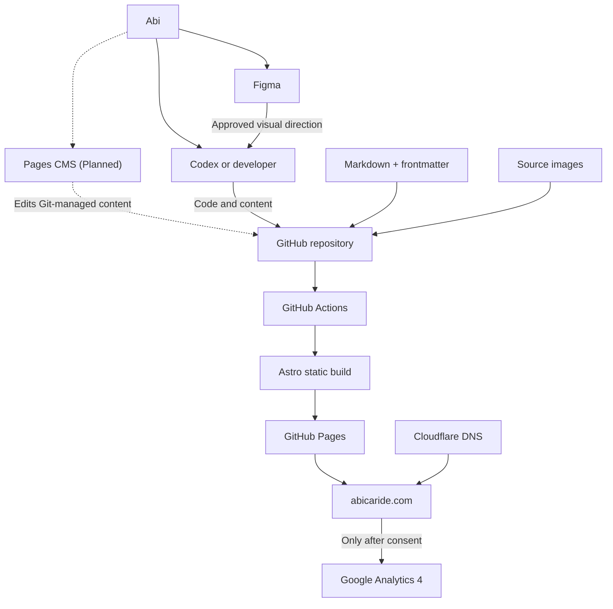
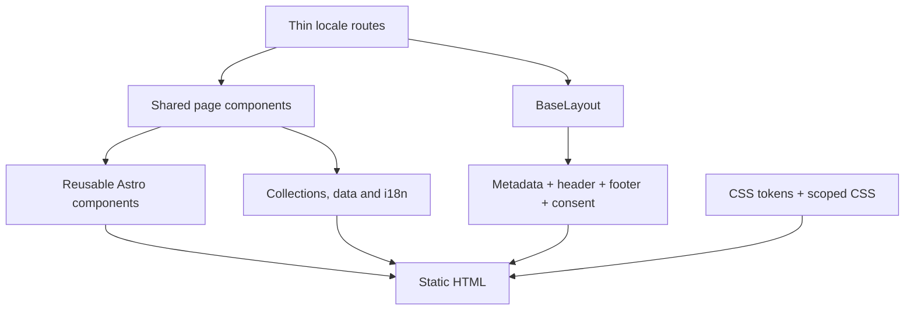
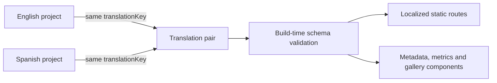
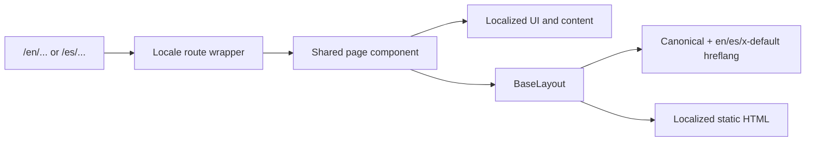
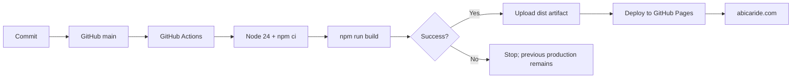
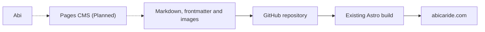
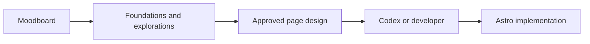

# Architecture of abicaride.com

This document describes the technical architecture of **abicaride.com** for a
technically literate reader who has not seen the project before. It documents
the current repository, separates implemented systems from plans and points to
the decisions that explain why the architecture exists.

## Status vocabulary

- **Implemented** — present in the repository or current operating environment.
- **Planned** — intended direction, not yet implemented.
- **Under consideration** — possible evolution without a committed decision.

## Project goals

abicaride.com is Abilene Caride's bilingual professional personal website. It is
a portfolio and professional identity site for presenting selected work,
experience and contact information in English and Spanish.

Its architecture optimizes for:

- simple operation and maintenance;
- fast, accessible static pages;
- portable content and assets;
- minimal JavaScript and dependencies;
- clear separation between content and presentation;
- privacy-conscious analytics;
- gradual complexity only when real requirements justify it.

## Architectural principles

### Static first

Astro generates HTML at build time. The current product does not need a backend,
runtime database or application server.

### Minimal client-side JavaScript

Pages are static HTML and CSS. The consent and analytics script is the deliberate
exception because it must respond to a visitor's local choice.

### Git as the production source of truth

Code, content, configuration and relevant assets live in the GitHub repository.
Figma expresses design intention, and a future CMS will edit Git-managed files;
neither replaces the repository.

### Content separated from presentation

Markdown, frontmatter, i18n copy and structured data hold information. Astro
components decide how that information is rendered.

### Accessibility, performance and privacy by default

Semantic HTML, visible focus, localized metadata, responsive images and
consent-gated analytics are architectural requirements rather than later
enhancements.

## High-level system architecture



Solid connections exist today. Dashed Pages CMS connections are planned.
Cloudflare is operational context documented by the project; its configuration
is external to this repository.

## Technology stack

### Application — Implemented

- Astro `^7.2.4` with static output;
- strict TypeScript through `astro/tsconfigs/strict`;
- Astro components and semantic HTML;
- native CSS and CSS custom properties;
- no client UI framework.

Astro is the only production dependency in `package.json`.

### Content — Implemented

- Astro Content Collections;
- Markdown bodies and validated frontmatter;
- a bilingual `projects` collection;
- structured bilingual data in `src/data/`;
- source-controlled local assets processed by Astro.

### Hosting — Implemented

- GitHub repository and Git history;
- GitHub Actions build workflow;
- GitHub Pages static hosting;
- Cloudflare-managed DNS outside the repository.

### Analytics — Implemented

- Google Analytics 4 through the Google tag;
- Basic Consent Mode v2 semantics;
- no Google Tag Manager or third-party consent platform;
- no custom analytics events or advertising features.

### Design and development — Implemented

- Figma for visual intention and exploration;
- Git and GitHub for source control;
- Codex or a local editor for implementation work.

### Editorial — Planned

- Pages CMS as the leading Git-based CMS candidate, subject to a proof of
  concept;
- a separate Writing collection for articles, notes or insights;
- an editorial interface for routine content changes.

### Under consideration

- whether CMS changes commit directly to `main` or use pull requests;
- which selected static-page content, if any, should become CMS-editable;
- preview and editorial validation behaviour.

## Repository structure

```text
src/
├── assets/                 Source images processed by Astro
├── components/
│   └── pages/              Shared EN/ES page composition
├── content/
│   └── projects/
│       ├── en/             English project Markdown
│       └── es/             Spanish project Markdown
├── data/                   Other structured bilingual content
├── i18n/                   Locale types, UI copy and path helpers
├── layouts/                Global HTML document layout
├── lib/                    Build-time content and routing helpers
├── pages/                  Static route entry points
└── styles/                 Design tokens and global CSS
```

Important boundaries:

- `src/pages/` owns routes. Locale files remain thin wrappers.
- `src/components/pages/` owns page composition shared by English and Spanish.
- `src/layouts/BaseLayout.astro` owns the document, global metadata, header,
  footer and consent component.
- `src/components/` owns reusable UI concepts.
- `src/i18n/config.ts` owns locale types, shared UI copy and localized paths.
- `src/content/projects/{locale}/` owns project narratives and metadata.
- `src/content.config.ts` owns the project schema.
- `src/data/` owns structured bilingual information outside collections.
- `src/styles/tokens.css` owns reusable design values; component styles remain
  scoped to their components.
- `src/assets/` owns images that enter Astro's processing pipeline. `public/`
  is reserved for stable URLs and files that Astro should not transform.

See [`AGENTS.md`](../AGENTS.md) for operational rules that protect these
boundaries.

## Rendering architecture



No hydration directives or SPA shell are present. The resulting `dist/`
directory is a deployable static artifact.

## Content architecture

### Projects collection — Implemented

Project entries live under:

```text
src/content/projects/en/
src/content/projects/es/
```

Each file combines structured frontmatter with a Markdown body. The Markdown
body is the primary narrative. Structured fields exist when build-time
validation, routing or reusable presentation needs them.

The actual schema in `src/content.config.ts` contains:

| Field | Required | Purpose |
| --- | --- | --- |
| `title` | Yes | Localized project title |
| `description` | Yes | Localized summary and page metadata |
| `locale` | Yes | `en` or `es` |
| `routeSlug` | Yes | Locale-specific URL slug |
| `translationKey` | Yes | Pairs translations across locales |
| `category` | Yes | Localized project category |
| `year` | No | Numeric year when useful |
| `company` | No | Organization associated with the work |
| `client` | No | Client when different from company |
| `role` | No | Abi's role |
| `period` | No | Human-readable project period |
| `featured` | Default `false` | Selects prominent projects |
| `order` | Yes | Positive integer controlling listing order |
| `draft` | Default `false` | Excludes unpublished entries from generated pages |
| `image` | Yes | Astro-managed source plus localized alt text |
| `metrics` | No | Reusable value, label and optional detail items |
| `gallery` | No | Astro-managed images with alt text and optional captions |
| `externalUrl` | No | Valid source or archive URL |
| `externalLabel` | No | Localized external-link label |
| `tags` | Default `[]` | Localized topic labels |

Generic reusable fields are preferred over fields tied to one project. This
keeps the collection useful for future professional case studies without
turning it into a page builder. Optional fields remain absent until real content
requires them.



`getProjectStaticPaths()` filters drafts, creates locale-specific routes and
finds the translated counterpart. `ProjectPage.astro` renders the Markdown body
and optional structured components.

### Writing collection — Planned

A separate Content Collection may later contain articles, notes or insights.
It is not implemented and no route or schema exists today.

Writing should remain separate from projects because articles have a different
editorial lifecycle, metadata model and navigation purpose. A future decision
must validate its real fields, bilingual strategy and publishing needs before
implementation.

## Internationalization

### Implemented routing model

- supported locales are `en` and `es`;
- every public content route is explicitly prefixed;
- `/` returns a temporary `302` redirect to `/en/`;
- equivalent locale routes render the same shared component;
- localized paths use `getLocalizedPath()`;
- privacy uses `/en/privacy/` and `/es/privacidad/`;
- the static `404.html` is one intentionally bilingual fallback.



Projects use independent translated entries rather than runtime machine
translation. Entries share a `translationKey` while retaining their own
`routeSlug`, narrative, labels and image alternatives. When a counterpart
exists, the language switcher and alternate metadata point to its real route;
otherwise project routing falls back to the other locale's project index.

Most shared UI copy lives in both branches of `ui` in `src/i18n/config.ts`.
Some existing component-level locale conditionals remain; they are a small
consistency issue to address during relevant future work, not a reason to change
the routing model.

## Images

Processed raster images live in `src/assets/` and are imported into Astro. The
site uses Astro's `<Picture>` component with responsive widths, `sizes`, AVIF and
WebP sources, and JPEG fallbacks where specified.

Current loading strategy:

- the homepage portrait and project hero images load eagerly with high fetch
  priority because they may be LCP candidates;
- project previews, gallery images and other below-the-fold images lazy-load;
- explicit intrinsic dimensions produced by Astro preserve aspect ratio and
  reduce layout shift;
- meaningful alternative text is localized; decorative linked preview images
  intentionally use empty alternatives where adjacent text provides the label.

Use `public/` only when an asset needs a stable URL or cannot enter Astro's
pipeline, such as favicons and the standalone analytics script.

## Analytics and consent

`AnalyticsConsent.astro` provides the localized, accessible UI.
`public/scripts/analytics-consent.js` owns the minimal browser logic.

The implementation uses Basic Consent Mode v2 semantics:

- no `gtag.js` request occurs before explicit analytics acceptance;
- before consent and after rejection, no GA cookies or measurement requests are
  created by the site;
- `analytics_storage` changes from denied to granted only after acceptance;
- `ad_storage`, `ad_user_data` and `ad_personalization` remain denied;
- the local preference expires after 180 days;
- the footer can reopen settings and withdrawal clears accessible GA cookies;
- there are no custom events, Google Tag Manager or advertising features.

This script is the intentional exception to the otherwise static client model.

## Deployment

`.github/workflows/deploy.yml` is the single production pipeline. It triggers on
pushes to `main`.



The pipeline is independent of whether a future commit originates in Pages CMS,
Codex, VS Code or another Git client. GitHub Pages hosts the output; Cloudflare
manages DNS outside the repository and does not replace the deploy pipeline.

## CMS architecture — Planned

Pages CMS is the leading candidate for a future editorial layer, subject to a
proof of concept. It is not installed or configured, and this repository has no
`.pages.yml`.



The CMS should remain an interface over Git-managed files, not a new source of
truth or database. The proof of concept must validate bilingual project pairs,
nested metrics, galleries, Astro image paths, Markdown editing, commits and the
existing deployment workflow.

It is planned primarily for projects and a future Writing collection. Making
selected static-page content editable remains under consideration.

See [ADR 006](decisions/006-pages-cms.md) for alternatives and trade-offs.

## Figma architecture

Figma describes visual intention; Astro is the production implementation.



The existing workspace separates:

- **Abi Website Moodboard** — references and preferences;
- **Abi Website Foundations** — foundations, components and explorations;
- **Abi Personal Website** — production-oriented page designs.

Moodboards and explorations are not approved specifications by default. There
is no requirement for perfect or automatic bidirectional Figma/code sync.

## Role of Codex

Codex can inspect the repository, edit content, implement approved designs,
modify layouts and components, evolve schemas and automate repeatable work.

It must still respect:

- [`AGENTS.md`](../AGENTS.md);
- the architectural boundaries above;
- the static-first and dependency-minimal direction;
- bilingual, accessibility, privacy and performance requirements;
- the same build and review discipline as manually written changes.

## Architectural non-goals

The project is intentionally not currently:

- a single-page application;
- a React application;
- a database-backed CMS;
- a server-rendered application;
- a page builder or arbitrary block system;
- a complex editorial platform;
- a real-time application.

These are not permanent prohibitions. They should be revisited if future product
requirements justify the additional complexity.

## Decision records

- [ADR 001 — Astro static site](decisions/001-astro-static-site.md)
- [ADR 002 — Git as source of truth](decisions/002-git-source-of-truth.md)
- [ADR 003 — Astro Content Collections](decisions/003-content-collections.md)
- [ADR 004 — Bilingual content model](decisions/004-bilingual-content-model.md)
- [ADR 005 — GitHub Pages deployment](decisions/005-github-pages-deployment.md)
- [ADR 006 — Pages CMS](decisions/006-pages-cms.md)
- [ADR 007 — Figma and code workflow](decisions/007-figma-and-code-workflow.md)

For day-to-day use, read [Working with abicaride.com](WORKFLOW.md).
