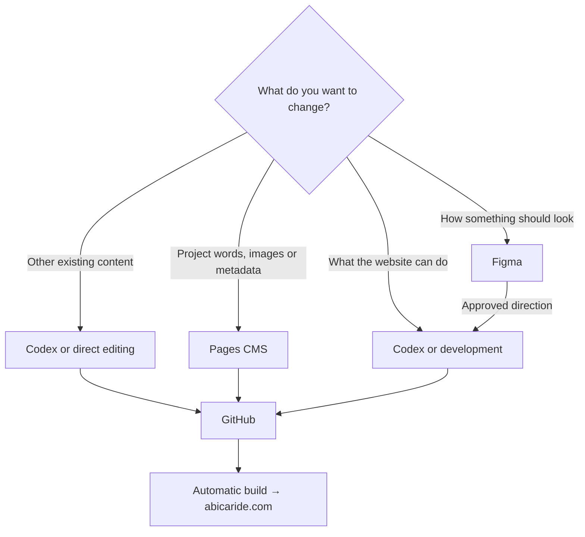
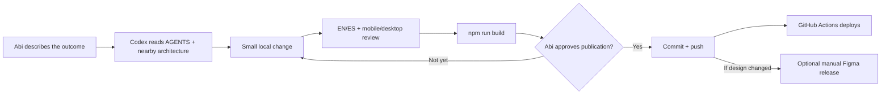
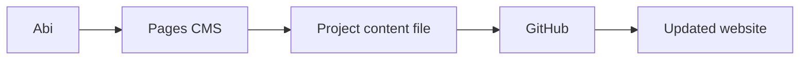
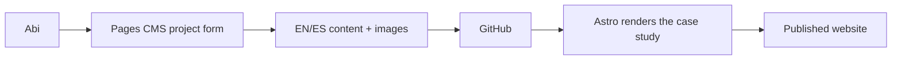
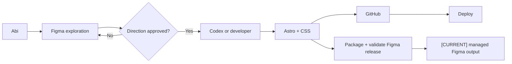
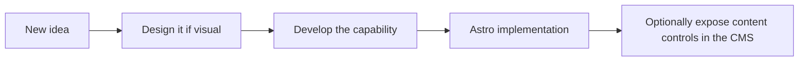
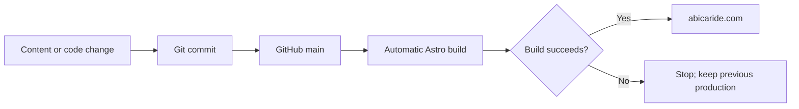

# Working with abicaride.com

This guide answers a practical question:

> **Where do I go when I want to change something?**

The simple mental model is:

> **The website lives in GitHub.**
>
> Figma is where we decide how it should look. Pages CMS is where Abi edits
> routine project content. Codex or a developer helps change what the website
> can do. Astro builds it. GitHub Actions publishes it.

## What exists today?

| Tool | Status | Use it for |
| --- | --- | --- |
| Figma | Implemented | Visual references, explorations and approved designs |
| Codex or a local editor | Implemented | Content and development work in the repository |
| GitHub | Implemented | The source files and their history |
| Astro | Implemented | Turning content and code into the static website |
| GitHub Actions | Implemented | Publishing changes pushed to `main` |
| Pages CMS | Implemented externally | Routine English and Spanish project content |
| Writing section | Planned | Articles, notes or insights separate from projects |

Pages CMS edits the existing project Markdown and source images in GitHub.
Writing and non-project pages are not CMS-managed. See the
[Pages CMS validation report](CMS-POC.md).

## The simplest rule

> **If the website already knows how to do it → edit the content.**
>
> **If we are deciding how it should look → use Figma.**
>
> **If the website needs to learn how to do it → use Codex or code.**



## Work safely with Codex

Abi can use Codex for both content and “vibe coding” without needing to know the
repository structure first. The safe pattern is to describe the outcome and let
Codex inspect the existing architecture before it proposes or makes a change.

| What Abi wants | Best starting point |
| --- | --- |
| Edit an existing project's words, metadata or images | Pages CMS |
| Prepare paired content, translate with review or make a broader copy change | Codex in the repository |
| Explore a visual direction | Figma, then Codex after approval |
| Add or change behaviour, layout, routes or content types | Codex in the repository |
| Synchronize implemented work back to Figma | Local publisher in Figma Desktop |

The Codex working loop is deliberately staged:



Useful guardrails for an Abi-authored Codex request are:

- ask Codex to preserve the current architecture and reuse existing components;
- state whether the work should stay local for review or may be committed and
  pushed—local editing never implies publication;
- provide facts and preferred voice, but do not ask Codex to invent professional
  outcomes, clients or audited metrics;
- keep a new project as a draft until its English and Spanish content, imagery
  and public voice have been reviewed;
- treat route slugs, featured status, ordering and `draft` as publishing controls;
- ask to see both a narrow mobile view and a desktop view for visual changes;
- expect Codex to report build results and anything it could not verify.

A compact prompt can be as simple as:

> Update this project in both languages using the supplied facts. Keep it as a
> draft, preserve the current architecture, show me the local result and run the
> build. Do not commit, push or publish to Figma yet.

## Change a sentence

For project content:



The routine project workflow is:

```text
Abi → Pages CMS → save → GitHub → automatic build → website
```

The CMS edits the same files that exist today. It does not create a second
content database.

### Access and branch permissions

The Pages CMS GitHub App is installed once for the `abicaride.com` repository;
there is no separate App installation per branch. Each editor signs into Pages
CMS with their own GitHub account, and GitHub repository permissions and branch
protection determine what that person can save.

Abi should use her own GitHub account for editorial work. Albert can edit only
while his GitHub account retains suitable repository access. Neither editor
needs ownership transferred. Routine saves to `main` trigger the existing GitHub
Actions deployment, just like any other commit.

## Add a case study

Today, a case study is added as an English and Spanish pair of Markdown files,
plus images in the repository. Codex or a developer can prepare and validate the
pair.

CMS workflow:



The project form should cover only information the website already supports,
such as title, company or client, role, period, metrics, gallery and narrative.
It should not force invented professional content into optional fields.

Pages CMS creates new entries with `draft: true`. Older files remain compatible
with Astro's historical `false` fallback when the field is absent, but editors
should use an explicit draft value. A draft is not included in project listings
or generated project routes.

## Publish an article

**Status: Planned**

There is no Writing collection or article route yet. The intended future flow is:

```text
Abi → CMS Writing → article → GitHub → Astro → website
```

Before this is possible, development must add and validate a separate Writing
content collection and its bilingual routes. Articles will remain separate from
professional project case studies.

## Change how the homepage looks



Figma explores and communicates the visual intention. It does not automatically
change the production website.

The shared design workspace is divided into:

- [Abi Website Moodboard](https://www.figma.com/board/PxH3eYTrRg5f2g8UenwGtP/Abi-Website-Moodboard)
  for references and preferences;
- [Abi Website Foundations](https://www.figma.com/design/2yrZXRDGo95taZ1J3VOPxx/Abi-Website-Foundations)
  for foundations, components and explorations;
- [Abi Personal Website](https://www.figma.com/design/qzSb1nHDgRm21LNLkCjaFT/Abi-Personal-Website)
  for production-oriented homepage and case-study designs.

All three links are public and view-only. Public readers can follow the design
process without joining the Figma team or receiving edit access. The repository
remains the implementation and production source of truth.

After implementation, the local design publisher regenerates editable
production-page snapshots, Foundations, implemented component references and
the current Moodboard summary. MCP is optional. These are explicit Figma
release actions, not part of website deployment.

Moodboard references and explorations are not approved designs by default.

### Publish the implemented state to Figma Desktop

Figma's free-tier MCP quota is not part of the release architecture. The
quota-independent route is the repository's local development plugin running
inside an authenticated Figma Desktop session. It uses the user's existing
Figma access without putting credentials in the repository or CI.

1. Commit the repository state that the visual release should represent.
2. Package and validate the publisher:

   ```sh
   npm run figma:package
   npm run figma:validate
   ```

3. In Figma Desktop, import or refresh
   `tools/figma/abi-brief-builder/manifest.json` under
   **Plugins → Development**.
4. Open the exact file and page, then run the matching command:

| File | Page/canvas | Command |
| --- | --- | --- |
| Abi Website Foundations | `01 — Foundations` | Publish current Foundations |
| Abi Website Foundations | `02 — Components` | Publish current Components reference |
| Abi Website Moodboard | FigJam canvas | Publish current Moodboard direction |
| Abi Personal Website | `01 — Homepage` | Publish current Homepage snapshot |
| Abi Personal Website | `02 — Case Studies` | Publish current imaginArt snapshot |
| Abi Personal Website | `03 — About + Archive` | Publish current About snapshot |
| Abi Personal Website | `03 — About + Archive` | Publish current Contact snapshot |

5. Visually verify the generated release label, page content, right-edge
   placement and separation from `[APPROVED]`, `[ARCHIVE]` and untagged manual
   work.

When the public Foundations canvas itself needs tidying, use **Prepare this
Foundations page for public viewing** once on each Foundations, Components and
Explorations page. This bounded maintenance command removes only the documented
Figma starter/intro allowlist, places current references at the origin and puts
the approved Exploration before its archives. It also clears obsolete prototype
start labels such as `Start here`. Because it deletes those known
historical layers, run it only after an explicit cleanup request and verify all
three pages immediately afterwards.

The Foundations page is deliberately stricter than Components and
Explorations: after confirming that its managed `[CURRENT]` section exists, the
cleanup removes every other loose top-level object. This prevents Figma starter
icons, text samples and imported source layers from expanding the public canvas.

Each current command builds its replacement and then removes only its own
tagged predecessor. That makes reruns repeatable, but it is still an external
Figma write and should happen only after an explicit request to synchronize the
design workspace. If the result is wrong, use Figma Undo, correct the repository
or publisher, package and validate again, and republish. Do not manually repair
the generated `[CURRENT]` section.

If the release label contains `+working-tree`, the output is useful as a preview
but is not the preferred traceable release. Commit the intended state, repackage
and publish again for the final synchronization. See the publisher
[runbook](../tools/figma/abi-brief-builder/README.md) for the complete safety and
rollback model.

## Add something the website cannot currently do

Examples include a new content type, an interactive gallery, an animation or a
new navigation pattern.



The CMS cannot invent capabilities. Development adds the capability first; a
later CMS form may expose the safe editorial choices.

## Interaction flows protected by the harness

Interactions are deliberately few and each has one owner. A change should
extend that owner rather than create a competing page-local script.

| Flow | Owner | Contract to preserve |
| --- | --- | --- |
| Root language choice | `src/pages/index.astro` | Browser preference, manual EN/ES links, English no-JavaScript fallback and no tracking/storage |
| Header and language navigation | `SiteHeader.astro` + localized path helpers | Correct active state, translated slugs and keyboard-readable links |
| Homepage and contact actions | Native links and anchors | Email remains a `mailto:` link; in-page work CTA remains a real anchor |
| Back to top | `BaseLayout.astro` + `BackToTop.astro` | Appears after the page intro, works by keyboard, respects reduced motion and does not cover consent UI |
| Analytics choice | `AnalyticsConsent.astro` + `analytics-consent.js` | No Google request before acceptance; reject remains request-free; footer/privacy settings reopen the choice |
| Responsive presentation | Astro images + component CSS | No distorted images, avoid layout shift and verify narrow and desktop views |

This inventory is also recorded as an enforceable agent rule in
[`AGENTS.md`](../AGENTS.md) and as a technical contract in
[Architecture](ARCHITECTURE.md#interaction-contracts).

## Publishing a change

All production changes follow the same path, regardless of where they started:



Git keeps the history, diff and rollback path. Pull requests are optional for
routine work today and can be used for larger or riskier changes.

## Who usually does what?

These are working tendencies, not rigid job descriptions.

### Abi

- professional positioning and project selection;
- case-study content, writing, images and translations;
- visual references, Figma exploration and design feedback;
- routine project editing through Pages CMS.

### Albert

- architecture, Astro and integrations;
- GitHub, deployment and Cloudflare coordination;
- analytics and design-system implementation;
- technical review of complex changes.

### Codex

- implementation assistance that follows `AGENTS.md`;
- direct content and code changes;
- translating approved designs into Astro;
- evolving schemas and automating repeatable development work;
- keeping changes local for review until commit, push, deployment or Figma
  publication is explicitly requested.

## Before considering a change finished

At minimum, the project must build successfully. Depending on the change, also
check both languages, language switching, links, mobile and desktop layouts,
keyboard access, responsive images, metadata and analytics consent behaviour.

If the Figma publisher changed, also run `npm run figma:validate`. A design
release is complete only after the Desktop command has run in the correct file
and page and its generated section has been visually checked.

For technical detail, read [Architecture](ARCHITECTURE.md). For the reasons
behind the main choices, read the [Architecture Decision Records](decisions/).
