# How abicaride.com works

This document explains how the tools behind **abicaride.com** fit together,
which system is authoritative for each kind of information, and which workflow
to use for a given change.

The simplest mental model is:

> **The production website is the Astro project in GitHub.**
>
> Figma explores visual direction. Content files hold editorial information.
> Codex or a developer changes the implementation. Astro builds the static
> website. GitHub Actions publishes it to GitHub Pages.

The CMS described below is a planned editorial interface. It is not connected
to the repository yet.

## System status

| System | Status | Responsibility |
| --- | --- | --- |
| Figma | Active | Visual references, foundations, explorations and approved page designs |
| Astro repository | Active | Production code, routes, presentation, content and configuration |
| Codex or local editor | Active | Technical and direct content changes to the repository |
| GitHub Actions | Active | Build and deployment pipeline |
| GitHub Pages | Active | Production hosting |
| Cloudflare | Active, external to this repository | DNS for `abicaride.com` |
| Google Analytics 4 | Active after consent only | Optional aggregate usage analytics |
| Git-based CMS | Planned | Friendly editing of the existing Markdown and frontmatter files |

## The big picture

The solid paths below exist today. The dashed CMS path is intentionally
deferred until real professional case studies have validated the content model.

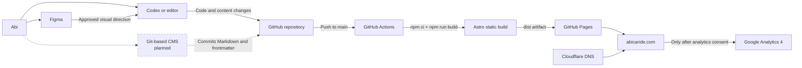

## Sources of truth

Different concerns have different authoritative homes. Keeping these boundaries
clear prevents Figma, a future CMS and the production implementation from
drifting into competing systems.

| Concern | Source of truth | Notes |
| --- | --- | --- |
| Live website | Astro code in this repository | What is deployed is determined by the repository, not by Figma |
| Visual intention | Approved Figma design | Explorations and moodboard references are not automatically approved |
| Project narratives and metadata | `src/content/projects/{locale}/` | Markdown remains the primary case-study narrative |
| Project schema | `src/content.config.ts` | Defines the fields that content files and a future CMS must respect |
| Shared interface copy and locale paths | `src/i18n/config.ts` | English and Spanish UI copy should stay paired |
| Other structured profile content | `src/data/` | Used for bilingual data that is not a content collection |
| Design values | `src/styles/tokens.css` | Reusable color, type, spacing and layout decisions |
| Deployment | `.github/workflows/deploy.yml` | Builds and publishes the static `dist/` artifact |
| DNS | Cloudflare | Managed outside this repository |

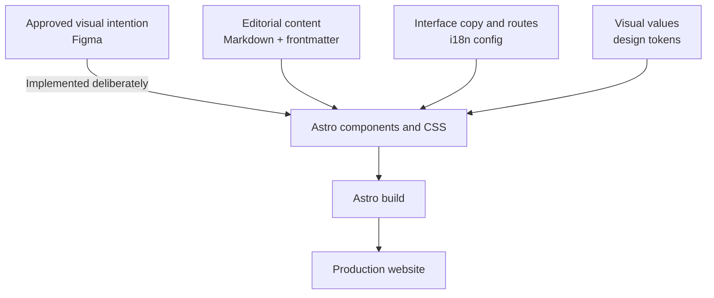

Figma is not a build dependency, and changing a Figma frame does not change the
website. Likewise, a CMS will not own presentation: it will edit repository
content that Astro already knows how to render.

## Which tool should I use?

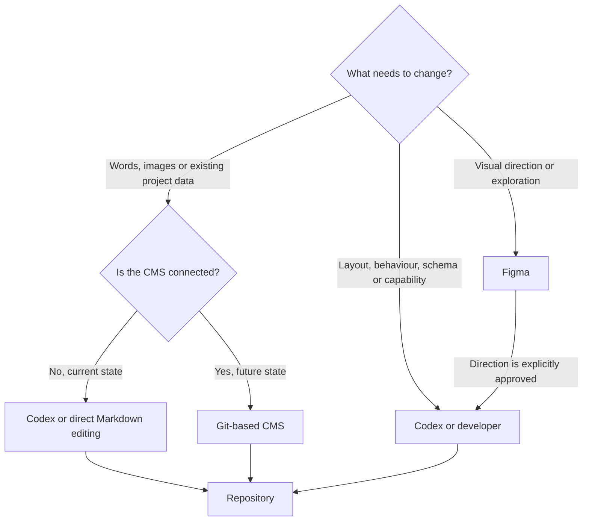

A useful rule is:

> If the website already knows how to represent the change, edit the content.
> If the website needs to learn a new capability, change the implementation.

### Use Figma for

- moodboards and visual references;
- typography, color, spacing and layout explorations;
- homepage and case-study concepts;
- component concepts that may later become reusable;
- comparing the current V1 baseline with future directions.

### Use content editing or the future CMS for

- titles, descriptions and narrative copy;
- project company, client, role and period;
- metrics and gallery entries supported by the schema;
- project images and localized alternative text;
- ordering projects with `order`;
- featuring or hiding projects with `featured` and `draft`;
- maintaining paired English and Spanish entries.

### Use Codex or a developer for

- layout and responsive behaviour;
- reusable Astro components;
- design tokens and typography implementation;
- new fields in the content schema;
- routing and internationalization behaviour;
- accessibility, performance and SEO architecture;
- consent, analytics and third-party integrations;
- any capability that the current website does not support.

## Figma workflow

The collaborative Figma workspace is intentionally split by responsibility:

- [Abi Website Foundations](https://www.figma.com/design/2yrZXRDGo95taZ1J3VOPxx/Abi-Website-Foundations)
  contains foundations, reusable components and visual explorations.
- [Abi Personal Website](https://www.figma.com/design/qzSb1nHDgRm21LNLkCjaFT/Abi-Personal-Website)
  contains production-oriented homepage and case-study designs, including the
  V1 homepage baseline.
- [Abi Website Moodboard](https://www.figma.com/board/PxH3eYTrRg5f2g8UenwGtP/Abi-Website-Moodboard)
  collects references and preferences. It is not an implementation
  specification.

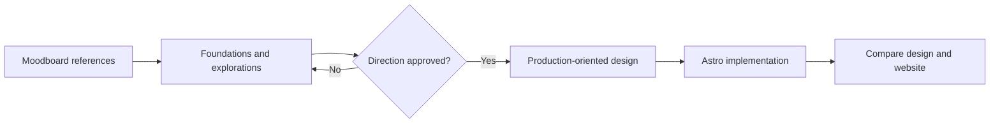

An agent should implement a Figma direction only when the task explicitly
identifies it as approved or asks for that specific design. Implementation must
still preserve the repository's Astro, bilingual, accessibility, privacy and
performance architecture.

## Content architecture

Project case studies are stored as Markdown entries:

```text
src/content/projects/en/
src/content/projects/es/
```

Each entry combines validated frontmatter with a Markdown narrative. The
narrative remains the primary content; structured fields are used only where a
reusable presentation is useful.

The current schema supports:

- `title`, `description`, `category` and `tags`;
- `locale`, `routeSlug` and `translationKey`;
- `image` with localized alternative text;
- `order`, `featured` and `draft`;
- optional `year`, `externalUrl` and `externalLabel`;
- optional `company`, `client`, `role` and `period`;
- optional structured `metrics` and `gallery`.

Translated projects share a `translationKey` but keep independent copy, slugs
and image alternatives.

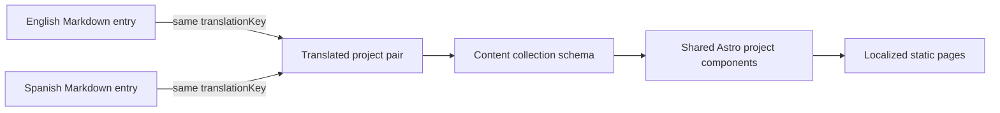

When adding a project today:

1. Add source images under `src/assets/images/projects/`.
2. Add the English and Spanish Markdown entries.
3. Give both entries the same `translationKey`.
4. Provide localized slugs, metadata, narrative and image alternatives.
5. Run the build and verify both URLs and language-switching links.

Do not invent professional case-study content to satisfy the schema. Optional
fields should remain absent until real content exists.

## Future CMS workflow

A future Git-based CMS such as Pages CMS should be a user interface over the
existing files, not a parallel content database.

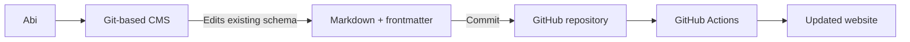

The CMS will not replace Astro, GitHub, the design system or the deployment
pipeline. It should be possible to remove the CMS later and continue editing the
same files directly.

Before connecting a CMS, the project still needs deliberate decisions about:

- authentication and repository permissions;
- whether editorial changes commit directly to `main` or open pull requests;
- image upload paths compatible with Astro's asset pipeline;
- bilingual project creation and translation pairing;
- preview, validation and error handling;
- the final field labels and help text based on real case studies.

This is why CMS configuration is deferred: the repository is CMS-friendly, but
it should not be configured around invented content requirements.

## Astro architecture

The implementation keeps localized routes thin and shares page composition.

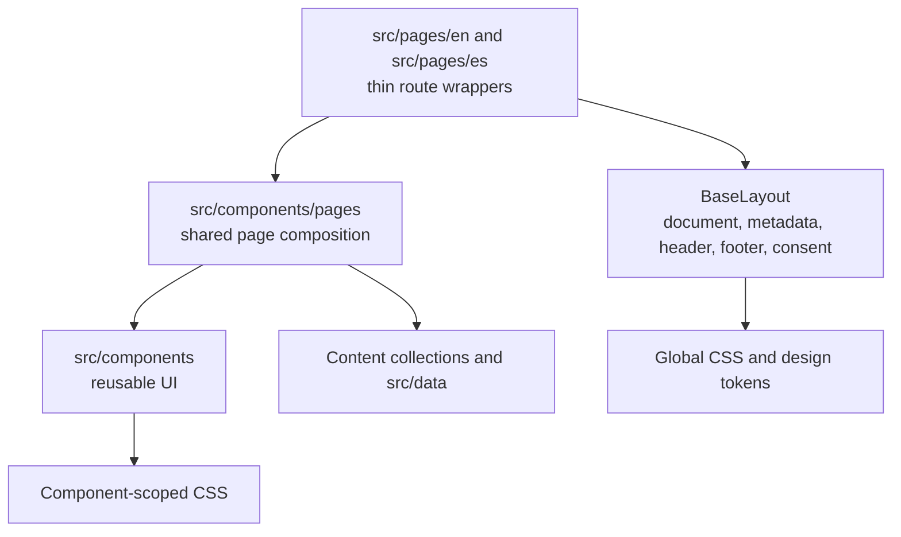

Key boundaries:

- `src/pages/` owns routes, not duplicated page presentation.
- `src/components/pages/` owns composition shared by both locales.
- `BaseLayout.astro` owns the document shell and global concerns.
- `src/components/` owns reusable concepts.
- `src/i18n/config.ts` owns shared interface copy and localized paths.
- `src/content/` and `src/data/` own content, separate from presentation.
- `src/styles/tokens.css` owns intentional reusable design values.
- `src/assets/` feeds Astro's image pipeline; `public/` is for stable URLs and
  files that cannot be processed by Astro.

The detailed contributor and agent rules are in [`AGENTS.md`](../AGENTS.md).

## Bilingual routing

All public content is locale-prefixed:

```text
/en/
/es/
```

The root route redirects to `/en/`. Equivalent locale routes render the same
shared page component with a different locale. Where paths differ—such as
`/en/privacy/` and `/es/privacidad/`—the page supplies the real alternate path.

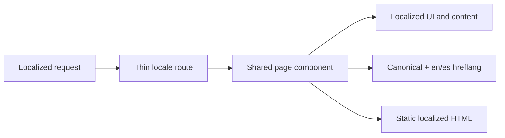

Project translations are paired by `translationKey`, allowing the language
switcher and alternate metadata to point to the correct translated slug.

## Publishing

There is one production deployment pipeline, defined in
`.github/workflows/deploy.yml`.

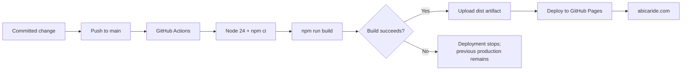

Whether a future change originates in a CMS, Codex or a local editor, it must
ultimately become a Git commit. Git provides history, diffs, attribution and a
rollback path. Pull requests are optional for routine work today and remain
available for larger or riskier changes.

## Analytics and privacy

The site uses Google Analytics 4 through the Google tag, without Google Tag
Manager or a third-party consent platform. Analytics is the intentional minimal
client-side JavaScript exception.

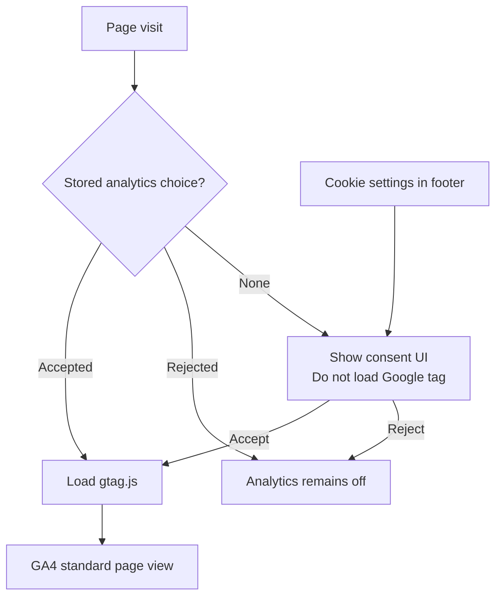

Before acceptance—and after rejection—the Google tag is not downloaded, GA
cookies are not created and no measurement request is sent. Advertising storage,
advertising user data and advertising personalization remain denied. There are
currently no custom analytics events.

## Validation before publishing

Every implementation change must pass:

```sh
npm run build
```

Additional checks should match the risk of the change:

- verify affected English and Spanish routes together;
- verify language switching, canonical URLs and `hreflang`;
- check internal links and the bilingual `404.html` fallback;
- inspect a narrow mobile viewport and a desktop viewport for visual work;
- preserve keyboard access, visible focus and semantic heading structure;
- check responsive image loading and layout stability;
- validate analytics before consent, after rejection and after acceptance;
- review the browser console for errors.

## Responsibilities

### Abi

Abi owns the professional positioning, project selection, case-study content,
copy, translations, images and visual direction. Over time, routine editorial
changes should become possible through the CMS.

### Albert

Albert supports the Astro architecture, GitHub and deployment workflow,
Cloudflare, analytics, design-system implementation and review of complex
technical changes.

### Codex

Codex helps translate a clearly stated intention into repository changes while
respecting `AGENTS.md`. It can edit existing content directly, implement an
approved Figma direction, or add a new technical capability. Generated changes
still require the same build and review discipline as manually written changes.

## Current lifecycle

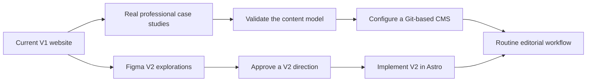

The goal is not to hide the technical system. It is to let each person use the
part that matches the change they want to make, while keeping one auditable
production source of truth.
