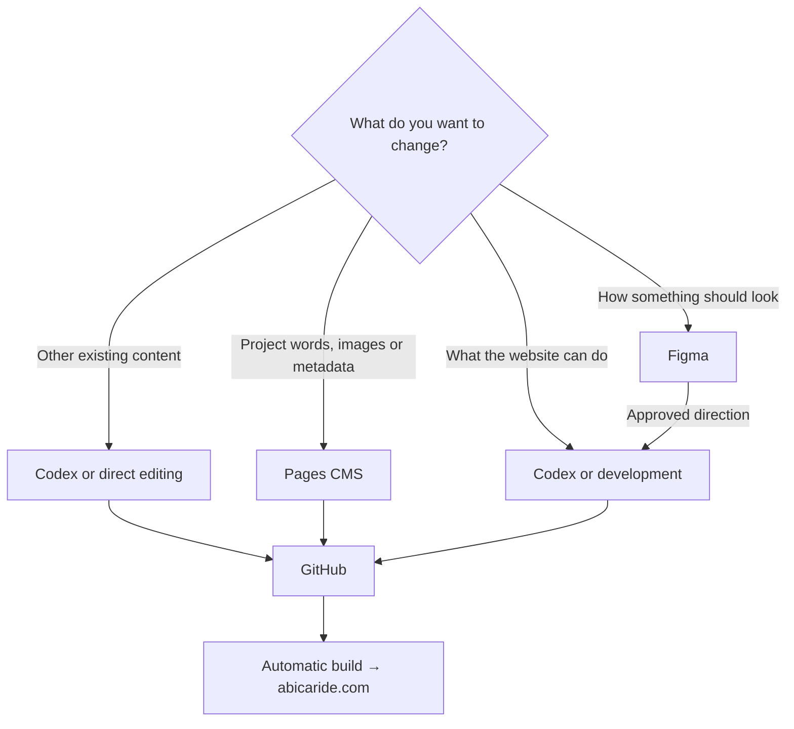
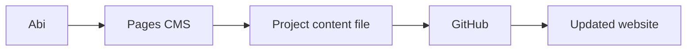
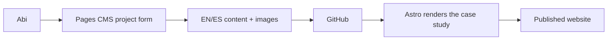
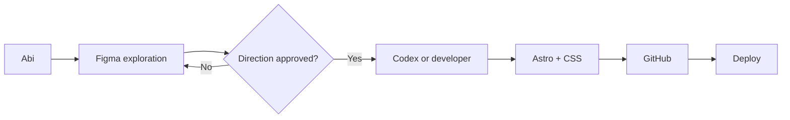
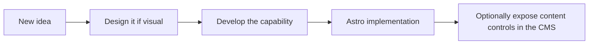
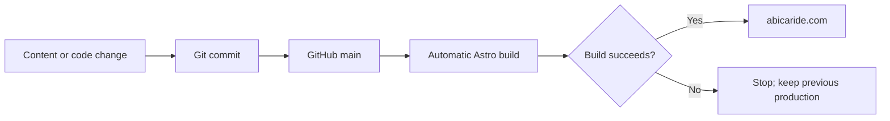

# Working with abicaride.com

This guide answers a practical question:

> **Where do I go when I want to change something?**

The simple mental model is:

> **The website lives in GitHub.**
>
> Figma is where we decide how it should look. Pages CMS is where Abi edits
> routine project content. Codex or a developer helps change what the website
> can do. Astro builds it. GitHub Actions publishes it.

## What exists today?

| Tool | Status | Use it for |
| --- | --- | --- |
| Figma | Implemented | Visual references, explorations and approved designs |
| Codex or a local editor | Implemented | Content and development work in the repository |
| GitHub | Implemented | The source files and their history |
| Astro | Implemented | Turning content and code into the static website |
| GitHub Actions | Implemented | Publishing changes pushed to `main` |
| Pages CMS | Implemented externally | Routine English and Spanish project content |
| Writing section | Planned | Articles, notes or insights separate from projects |

Pages CMS edits the existing project Markdown and source images in GitHub.
Writing and non-project pages are not CMS-managed. See the
[Pages CMS validation report](CMS-POC.md).

## The simplest rule

> **If the website already knows how to do it → edit the content.**
>
> **If we are deciding how it should look → use Figma.**
>
> **If the website needs to learn how to do it → use Codex or code.**



## Change a sentence

For project content:



The routine project workflow is:

```text
Abi → Pages CMS → save → GitHub → automatic build → website
```

The CMS edits the same files that exist today. It does not create a second
content database.

### Access and branch permissions

The Pages CMS GitHub App is installed once for the `abicaride.com` repository;
there is no separate App installation per branch. Each editor signs into Pages
CMS with their own GitHub account, and GitHub repository permissions and branch
protection determine what that person can save.

Abi should use her own GitHub account for editorial work. Albert can edit only
while his GitHub account retains suitable repository access. Neither editor
needs ownership transferred. Routine saves to `main` trigger the existing GitHub
Actions deployment, just like any other commit.

## Add a case study

Today, a case study is added as an English and Spanish pair of Markdown files,
plus images in the repository. Codex or a developer can prepare and validate the
pair.

CMS workflow:



The project form should cover only information the website already supports,
such as title, company or client, role, period, metrics, gallery and narrative.
It should not force invented professional content into optional fields.

## Publish an article

**Status: Planned**

There is no Writing collection or article route yet. The intended future flow is:

```text
Abi → CMS Writing → article → GitHub → Astro → website
```

Before this is possible, development must add and validate a separate Writing
content collection and its bilingual routes. Articles will remain separate from
professional project case studies.

## Change how the homepage looks



Figma explores and communicates the visual intention. It does not automatically
change the production website.

The shared design workspace is divided into:

- [Abi Website Moodboard](https://www.figma.com/board/PxH3eYTrRg5f2g8UenwGtP/Abi-Website-Moodboard)
  for references and preferences;
- [Abi Website Foundations](https://www.figma.com/design/2yrZXRDGo95taZ1J3VOPxx/Abi-Website-Foundations)
  for foundations, components and explorations;
- [Abi Personal Website](https://www.figma.com/design/qzSb1nHDgRm21LNLkCjaFT/Abi-Personal-Website)
  for production-oriented homepage and case-study designs.

All three links are public and view-only. Public readers can follow the design
process without joining the Figma team or receiving edit access. The repository
remains the implementation and production source of truth.

Moodboard references and explorations are not approved designs by default.

## Add something the website cannot currently do

Examples include a new content type, an interactive gallery, an animation or a
new navigation pattern.



The CMS cannot invent capabilities. Development adds the capability first; a
later CMS form may expose the safe editorial choices.

## Publishing a change

All production changes follow the same path, regardless of where they started:



Git keeps the history, diff and rollback path. Pull requests are optional for
routine work today and can be used for larger or riskier changes.

## Who usually does what?

These are working tendencies, not rigid job descriptions.

### Abi

- professional positioning and project selection;
- case-study content, writing, images and translations;
- visual references, Figma exploration and design feedback;
- routine project editing through Pages CMS.

### Albert

- architecture, Astro and integrations;
- GitHub, deployment and Cloudflare coordination;
- analytics and design-system implementation;
- technical review of complex changes.

### Codex

- implementation assistance that follows `AGENTS.md`;
- direct content and code changes;
- translating approved designs into Astro;
- evolving schemas and automating repeatable development work.

## Before considering a change finished

At minimum, the project must build successfully. Depending on the change, also
check both languages, language switching, links, mobile and desktop layouts,
keyboard access, responsive images, metadata and analytics consent behaviour.

For technical detail, read [Architecture](ARCHITECTURE.md). For the reasons
behind the main choices, read the [Architecture Decision Records](decisions/).
